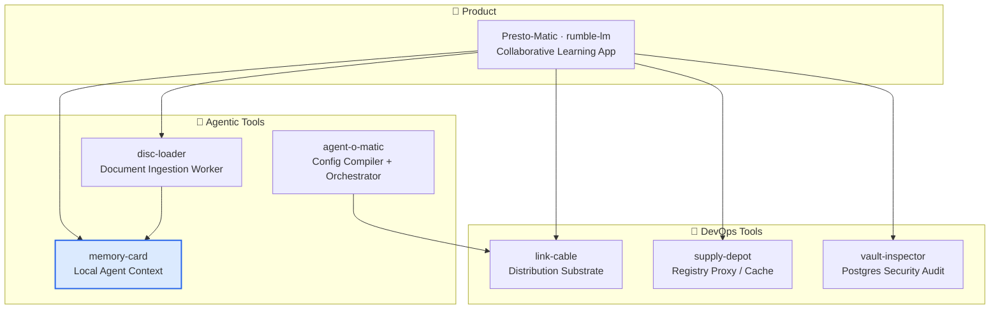

# memory-card

> Local agentic context layer — code map, repo memory, and search substrate for coding agents. No hosted services, no hidden telemetry.

[](LICENSE)
[](https://www.rust-lang.org)
[](https://github.com/constantin-jais/memory-card/actions/workflows/ci.yml)

> **Status:** `0.0.0` skeleton — boundary, upstream policy, and CI gates are explicit before implementation starts.

## Why it exists

Agents need durable, local context without burning model context windows or depending on a hosted service. `memory-card` provides a transparent, per-repo cache that agents query for code maps, document indexes, and history — fully auditable and portable.

## Ecosystem



## Contract

|                 |                                                      |
| --------------- | ---------------------------------------------------- |
| **Interface**   | CLI and JSON reports for indexing status and queries |
| **Storage**     | Local per-repo cache keyed by repository identity    |
| **Portability** | Explicit import/export for auditable memory entries  |

## Non-goals

- No hosted SaaS control plane
- No hidden telemetry
- No requirement for Presto-Matic runtime

## Upstream

|               |                                                                                                            |
| ------------- | ---------------------------------------------------------------------------------------------------------- |
| **Project**   | [basemind](https://github.com/Goldziher/basemind)                                                          |
| **Policy**    | Upstream-first, pinned releases/commits, no permanent fork                                                 |
| **Fork rule** | Only for a blocking security/build/sovereignty patch; open the upstream PR and remove the fork once merged |

## Development

```bash
cargo fmt --all --check
cargo clippy --workspace --all-targets --all-features
cargo test --workspace --all-features
```

## Related projects

| Repo                                                                  | Role                                                 |
| --------------------------------------------------------------------- | ---------------------------------------------------- |
| [Presto-Matic](https://github.com/constantin-jais/Rumble-LM)          | Primary consumer — agent context for RAG and codegen |
| [disc-loader](https://github.com/constantin-jais/disc-loader)         | Feeds extracted document text into memory-card       |
| [agent-o-matic](https://github.com/constantin-jais/Agent-O-Matic)     | Config compiler and autonomous orchestrator          |
| [link-cable](https://github.com/constantin-jais/link-cable)           | Multi-platform distribution substrate                |
| [supply-depot](https://github.com/constantin-jais/supply-depot)       | Sovereign registry proxy / cache                     |
| [vault-inspector](https://github.com/constantin-jais/vault-inspector) | Postgres security audit                              |

## License

MIT © Constantin Jais
